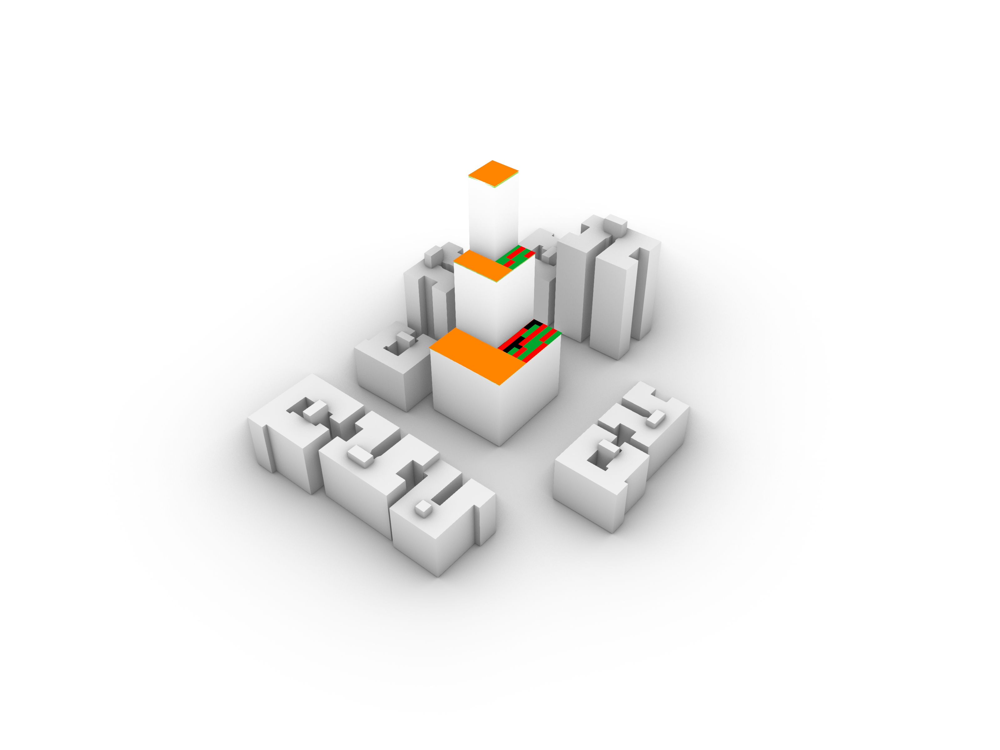
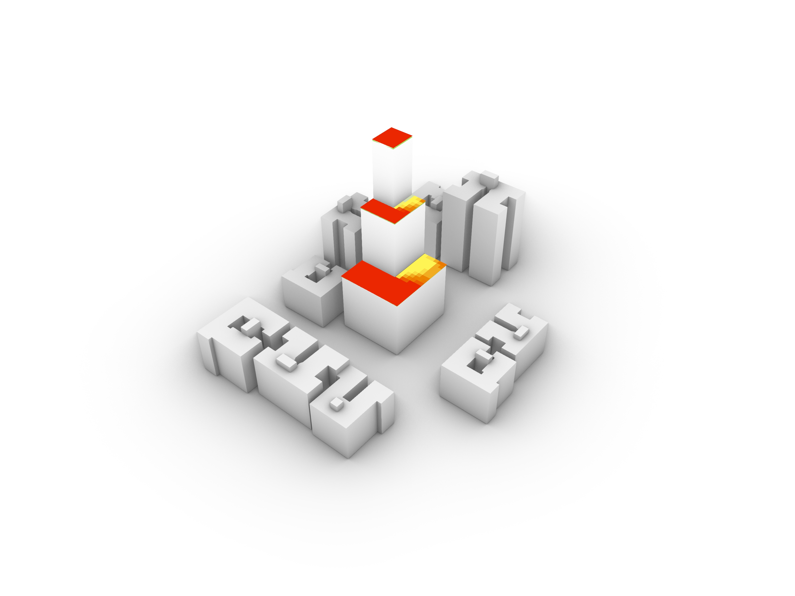
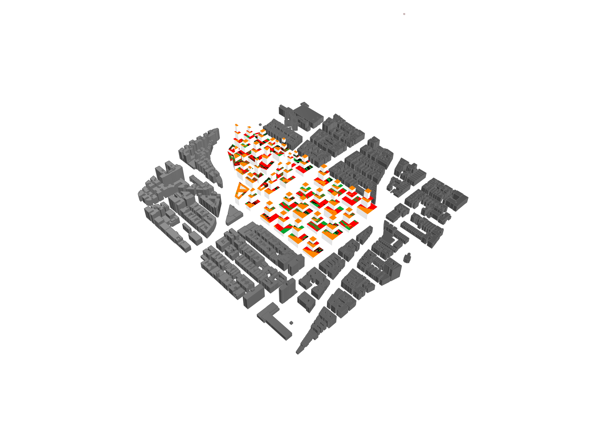
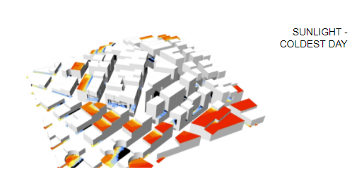
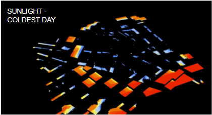
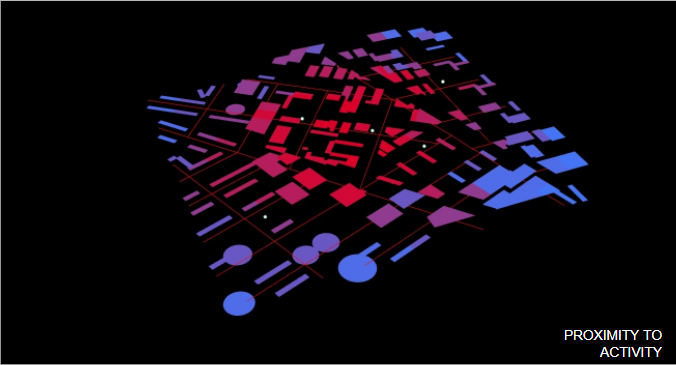
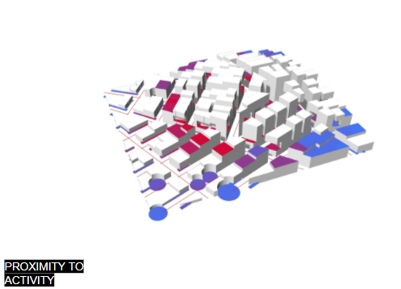

# Environmental Tools

The list below includes all of the Environmental Tools. Please follow the temple to document each tool.

<!--NEW TOOL BELOW-->

## Sufficient Daylight Hour Tool
<!--add your title on the first line above-->

<!--add your summary image here, try to make it explanatory of what the tool does, not just what the output looks like. For example, exposure a part of the analysis geometry. An animated GIF can also be used to explain how the tool is working-->

<!--  -->

### Description

<!--add your description below-->

This tool analyzes average daylight hours of exterior horizontal spaces that can be used as garden hours. Then it dispatches the surfaces with sufficient amount of daylight to a vegetable type.

### How To Use

<b>Step by Step Instructions:</b>

1. Right click on "Geo: Lots" -> Select Multiple and select lot areas for towers.
2. Toggle between 'Tower Type' and 'FAR' to get desired shape and size.
2. Link to epw file
2. Right click on "Context" -> Select Multiple and select building obstructions.
3. Adjust 'Analysis Resolution', 'Start Time', 'End time', 'Day', and 'Month' accordingly to your analysis.
5. Adjust 'Min Hour Threshold'.
6. Review visual and metric outputs. Does it look correct? Does something look wrong? Common issues below.

<b> Troubleshooting </b>

Make sure to properly load the context as it is crucial for to test the daylight hours correctly

Make sure all the inputs have been loaded correctly.

<!--add a list your downloadable links below with "link " appended to the beginning. You should have sample rhino + grasshopper files and a legend-->

(../files/Analysis Tool Example.3dm)
link Analysis Tool Example.gh
link grasshopper_tree.jpg
link Analysis Tool Example.ai
(../files/Analysis Tool Example.3dm)

<!--  -->

### Modeling Standards
<!--Revise for specific modeling requirements for you analysis to run properly. If useful, add an image of properly vs improperly model geometry-->
<b>Please follow the following Rhino standards to ensure the proper functionality of the tool: </b>

<input type="checkbox"> <b>My test curve is a single CLOSED polyline.</b>

  <li>Try "SelClosedCrv" to make sure it is closed.</li>

<input type="checkbox"> <b>My model is oriented to True North.</b>

  <li>Re-orient if it was rotated off of North at the start of the project.</li>

<input type="checkbox"> <b>Any groups or blocks in building context have been ungrouped.</b>

  <li>Try "SelBlockInstance" and "SelGroup" to make sure.</li>

<input type="checkbox"> <b>My model is set to either Meters or Feet (not mm or in).</b>

<input type="checkbox"> <b>My model is free of overlapping, coplanar, or intersecting geometry.</b>

<input type="checkbox"> <b>Any obstructions around the space have been modeled (trees, topography, buildings).</b> 

<input type="checkbox"> <b>Any curved surfaces in the model have been simplified to individual flat planes.</b>

### Sources, Calculations + Metrics
<!--add text and/or images for any sources for you metrics, calculations & equations, assumptions and specific metric output-->
This tool extracts exterior horizontal spaces and turns them into garden areas. It calculates the amount of sunlight each of those surfaces receive, and then dispatches the surfaces that receive sufficient daylight to a specific vegetable type. The vegetable types are already predetermined but it can be changed.

### Limitations & Context
<!--add text and/or images that expose potential for bias by stating limitations (ie what does this tool not do,) and the context in which it was created.-->

The limitation of the tool is that it does not take into consideration the climate necessary for vegetable growth. It only calculates if the areas receive sufficient daylight.

### Examples
<!--add images and text to describe a use case below-->
Here is how we used this tool on a project!

<!--  -->

#### Tool Author: Food Oasis

<!--NEW TOOL BELOW-->

## Beneficial Daylight for Facades Analysis Tool

### Tool Description

This analysis tool explores building in winter and summer sunlight time. In consideration of energy consumption, the building should reduce direct sunlight in summer as much as possible to prevent heat, and increase direct sunlight in winter to ensure insulation. Area that meets both summer shading and winter lighting can be understood as a sustainable area. This Analysis Tool visualizes the distribution of these sustainable areas.

### Required inputs

1. Dynamic: Context Mesh: merge context and target buildings into meshes

2. Static:

(1)Building Surface Subdivision Number: this input data should not larger than 50.

(2)Winter Sun Path

(3)Winter sunrise and sunset time domain

(4)Winter Sunlight Hours Threshold: 3

(5)Summer Sun Path

(6)Summer sunrise and sunset time domain

(7)Summer Sunlight Hours Threshold: 6

### Tool Rules

1. With sun path and sunlight time Domain, the battery output two groups of data about energy consumption based on the current building: Winter Sunlignt Hours and Summer Shadow Hours. For winter, the sunlight time on the winter solstice is about 3hours. We think that “winter sun > 3hours/day” is relatively ideal. For summer, we arrange the sunlight time in order, ensuring enough shadow in summer. we think that “summer sun < 6hours/day”is beneficial.
2. "Sustainable Facade " in output data indicates the percentage of the facade area that meets both “winter sun > 3hours/day” and “summer sun < 6hours/day”.
3. Area that meets both summer shading and winter lighting can be understood as a sustainable area. “Mesh Analysis” visualizes the distribution of these sustainable areas.

### Modeling Standards

1. Please follow the following Rhino standards to ensure the proper functionality of the tool:
2. Model is oriented to True North.
3. Model is set to either Meters or Feet (not mm or in).
4. Model is free of overlapping, coplanar, or intersecting geometry.
5. Any obstructions around the space have been modeled (trees, topography, buildings).
6. Any curved surfaces in the model have been simplified to individual flat planes.
7. Any surrounding context has been made into a single, joined mesh.

### Limitations & Context

1.The current sunshine information is in New York. If you want to apply to other cities, please link the correct Sun Path Curve and sunrise/ Sunset Domain.
2.The analysis tool doesn't measure the building energy.

### Required Plugins

No specific plugins necessary

### Required Files

[Rhino File](https://github.com/YuanEleanorLiu/XIM-GSAPP-Fa20/raw/main/src/tools/Environmental/Average_Daylight/Beneficial%20Daylight%20for%20Facades%20Analysis%20Tool.3dm)

[Grasshopper File](https://github.com/YuanEleanorLiu/XIM-GSAPP-Fa20/raw/main/src/tools/Environmental/Average_Daylight/Beneficial%20Daylight%20for%20Facades%20Analysis%20Tool.gh)

#### Tool Author: Energy Efficient Communities Team

<!--NEW TOOL BELOW-->

## The Public Space Average Daylight

<!--add your title on the first line above-->
### Type Description

### Required inputs

Description to be added

### Type Rules

Description to be added

### Use Type If:

Description to be added

### Not Recommended to Use Type If:

Description to be added

### What to Know & Limitations

Description to be added

### Required Plugins

N/A

#### How To Use

Description to be added

### Required Files

[Rhino File](https://github.com/tterrytang/the-great-outdoor/blob/main/The%20Great%20Outdoors%20(1).3dm)

[Grasshopper File](https://github.com/tterrytang/the-great-outdoor/blob/main/great%20out%20door%20building%20types.gh)
